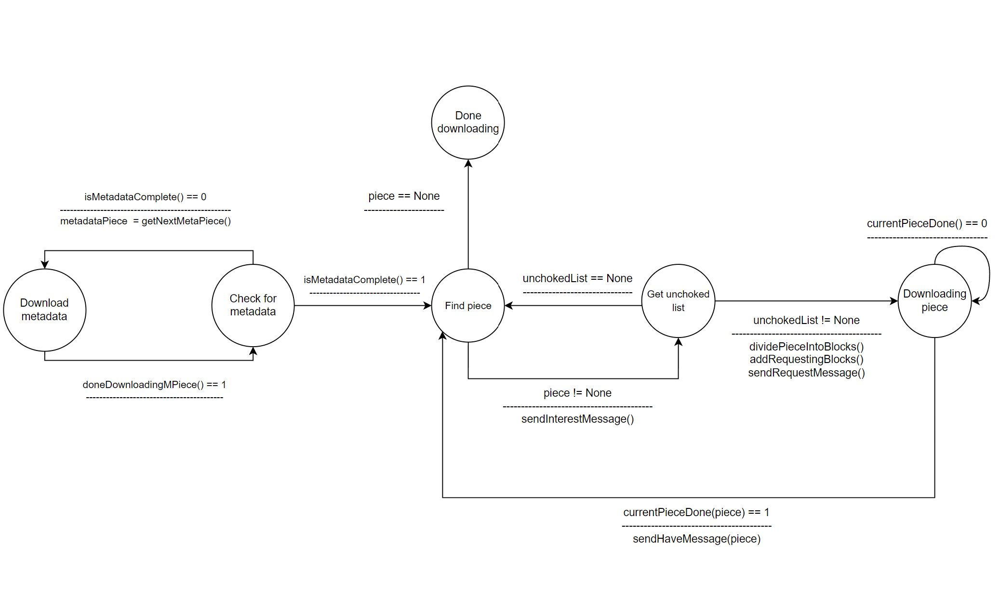

# torrent-like-application

A minimal BitTorrent‑style client and tracker reimplementation, following BEP 0, 1, 3, 9, 10, 20, 23.

## Architecture

### Tracker API (GET /announce)

Clients call the tracker to register themselves and fetch the current peer list.  
The tracker periodically prunes peers that haven’t re‑announced in time.


### Tracker Notifications

Each client must “heartbeat” the tracker at regular intervals so its entry remains active.


## P2P Clients

### Download Procedure

Pieces are requested in rarest‑first order to maximize swarm diversity.  
Metadata is fetched first; then pieces are requested, assembled, verified, and a HAVE is broadcast on completion.



### Upload Procedure

Implements a tit‑for‑tat strategy: interested peers are unchoked in proportion to their contribution, while others remain choked.


## Demo

### First seeder in the swarm

Initial seeder starts sharing the complete “slide” payload.


### Fourth seeder in the swarm

Additional seeders join later to improve availability and resilience.


### Multitask client

A peer that downloads missing pieces while simultaneously uploading completed ones.


## Installation on Windows

```bash
conda create -n p2p python -y
conda activate p2p
pip install -r requirements.txt
pip install pyqt6-tools qt_material
```

## Tracker Installation & Run

```bash
cd server
uvicorn main:app --host 0.0.0.0 --port 8000 --reload
```
### Magnet Link

```bash
magnet:?xt=urn:btih:2b3b3f7e4e9d3f1e1f3f4e9d3f1e1f3f4e9d3f1&
dn=ubuntu-20.04-desktop-amd64.iso&
tr=udp://tracker.opentrackr.org:1337/announce
```

### Sample tracker request

```bash
http://localhost:8000/announce?
info_hash=1234567890abcdef1234567890abcdef12345678&
peer_id=peer1&
port=20007&
uploaded=0&
downloaded=0&
left=1000&
compact=1&
event=started
```